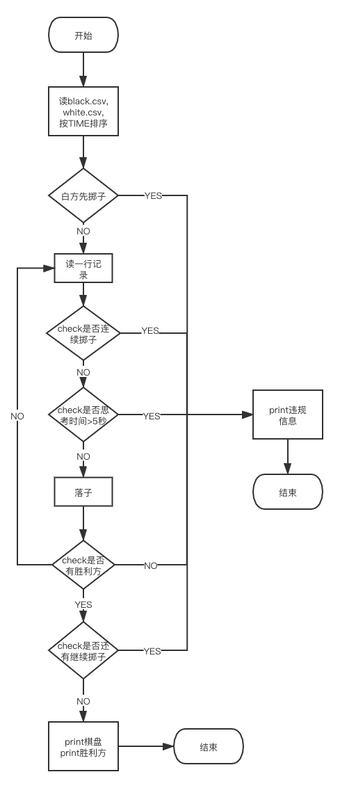
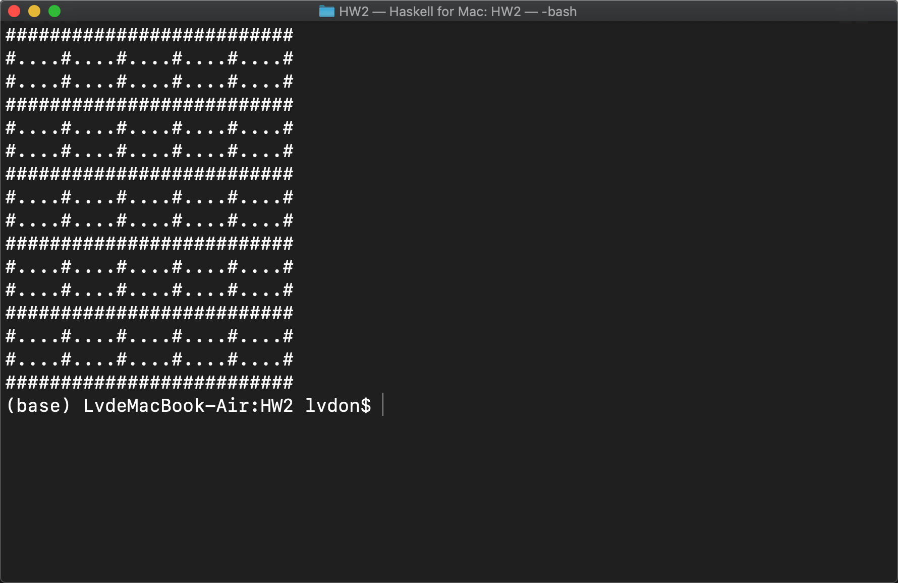
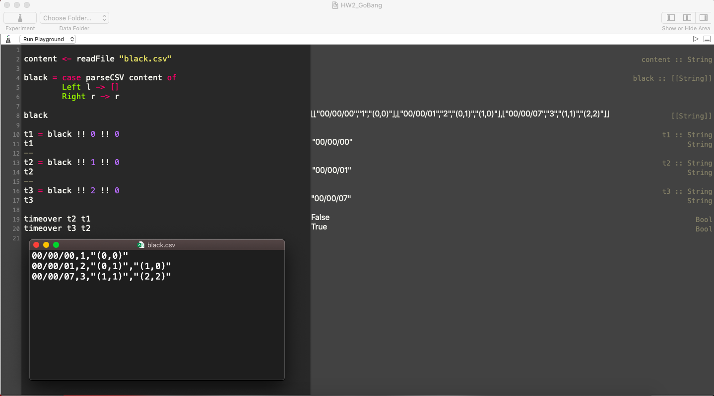

 

使用方法：

在code根目录下:l Main.hs，下棋的几个关键函数：

       auto 0 : 调用黑棋AI下棋

       auto 1：调用白棋AI下棋

       manual 0: 手工下黑棋

       manual 1：手工下白棋

       showBoard:显示当前棋盘

 

 

项目结构说明：

六子棋AI的关键函数都在/AI 目录下。/Records 目录主要是棋谱数据库的定义和格式转换。/Boards主要是棋盘UI的设计

# 算法流程图
<div align=center></div>

# Checkerboard

```haskell
type Board = [[Int]]

{-|
  函数'getBoard'获取棋盘的字符串列表形式
  @input    棋盘
  @output   字符串列表的Picture格式
-}
getBoard :: Board -> Picture

{-|
  函数'printBoard'打印棋盘的字符串列表形式
  @input    棋盘
  @output   打印Picture的IO
-}
printBoard :: Board -> IO ()

{-|
  函数'win'打印棋盘的字符串列表形式
  @input    棋盘
  @output   按行、列、主对角线、次对角线次序
            判断是否有winner(6子一线)。
            1:黑子胜利  -1:白子胜利   0:无winner
            (该函数只要找到一个解就会停止)
            
-}
win :: Board -> Int
```

## win调用结果:
<div align=center></div>

## printBoard调用结果(5*5 board):
<div align=center></div>

# CsvParser
```haskell
{-|
  函数'parseCSV'解析.csv文件
  @input    文件内容 
  @output   [[String]]格式的解析结果
-}
parseCSV :: String -> Either ParseError [[String]]
```

# Times
```haskell
{-|
  判断是否超时的函数
  @input 'newStr' 新时间的字符串格式
  @input 'oldStr' 老时间的字符串格式
  @output 'Bool'  相差大于5s输出True；否则False
-}
timeover :: String -> String -> Bool
```

## csv解析器与timeover使用样例：
<div align=center></div>

# Utils
矩阵相关辅助函数
```haskell
{-|
  函数'diagonals'获取矩阵的所有对角线(左下到右上)
  @input     二维方阵
  @output    对角线组成的新的二维矩阵
-}
diagonals :: [[a]] -> [[a]]
    
{-|
  函数diagonals'获取矩阵的所有对角线(右下到左上)
  @input     二维方阵
  @output    对角线组成的新的二维矩阵
-}              
diagonals' :: [[a]] -> [[a]]

{-|
  acts like python 'find'. 
  returns the leftmost element index
  or -1 if there is no such element.
-}
find' :: (Eq a) => [a] -> [a] -> Int

{-|
  函数'replaceNth'改变一维列表中元素的值
  @input 'xs'      一维列表
  @input 'n'       下标
  @input 'newVal'  改变后的值
  @output    将'xs!!n!!'改变为'newVal'后新的列表
-}
replaceNth :: [a] -> Int -> a -> [a]
 
{-|
  函数'change_elem'改变二维列表中元素的值
  @input 'xs'     二维数组
  @input '(x,y)'  坐标
  @input 'x'      改变后的值
  @output    将'xs!!row!!col'改变为'x'后新的二维列表
-}
change_elem :: [[a]] -> (Int,Int) -> a -> [[a]]
```